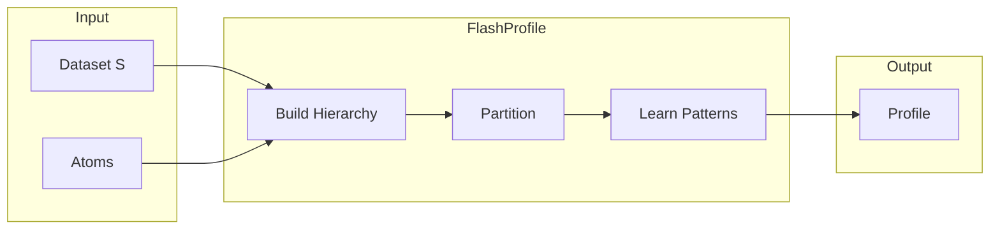
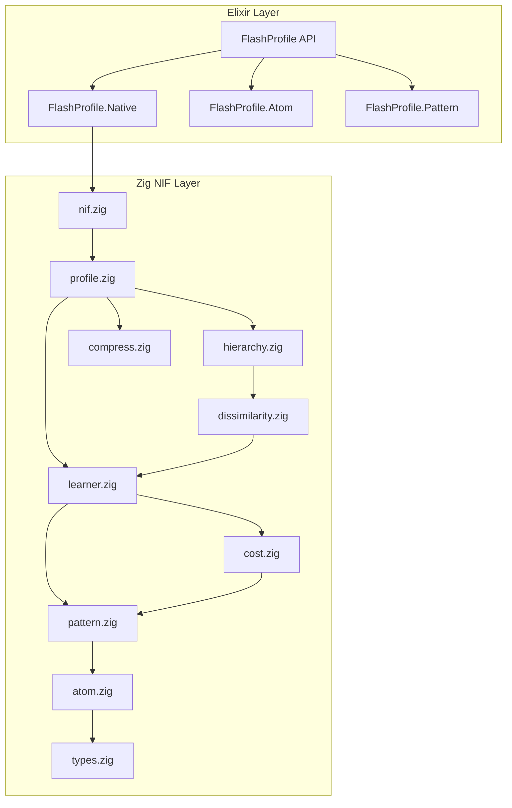
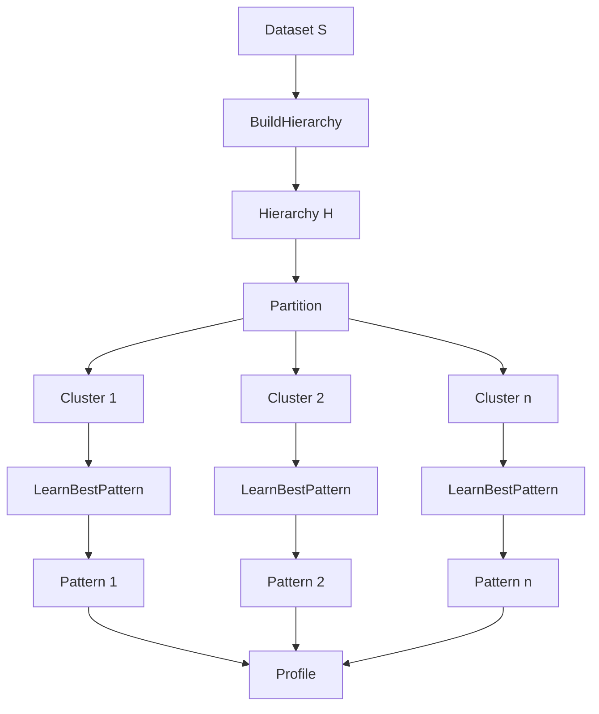
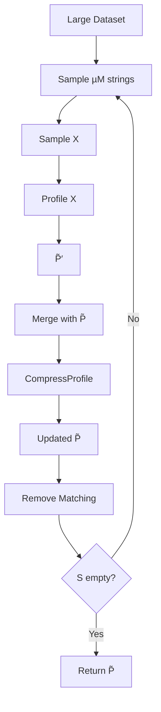
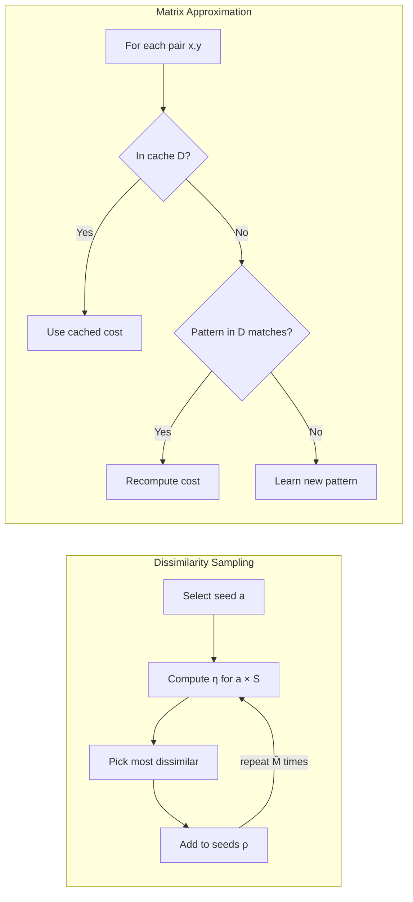
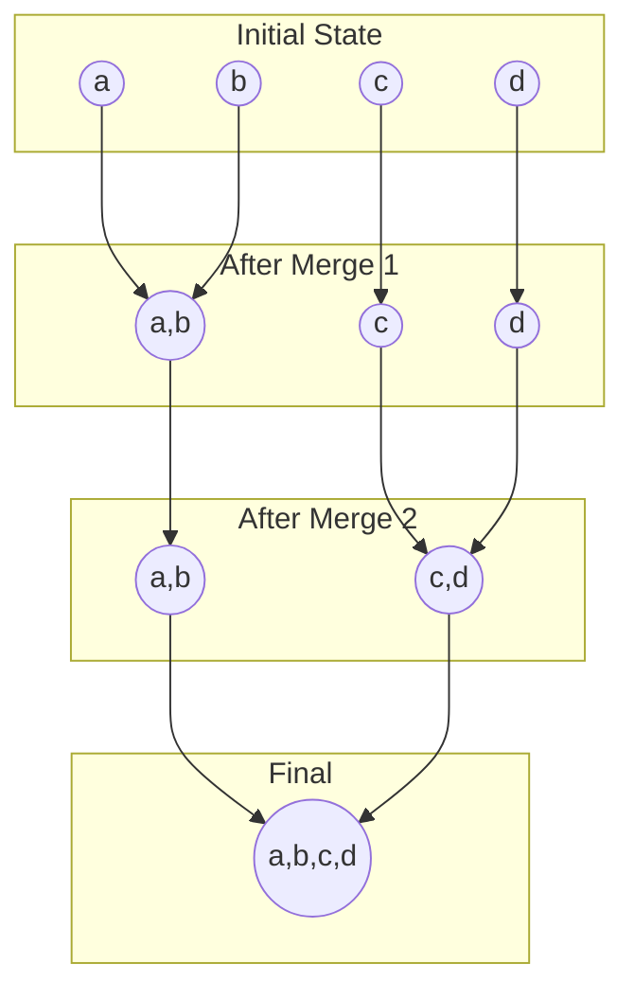
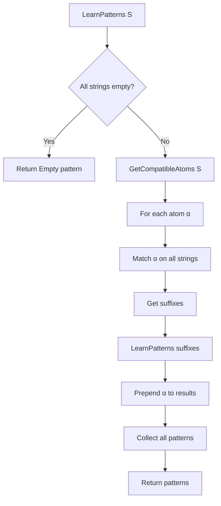

# FlashProfile Architecture

A high-performance implementation of the FlashProfile algorithm for syntactic
data profiling, based on the paper
["FlashProfile: A Framework for Synthesizing Data Profiles"](https://doi.org/10.1145/3276520)
by Padhi et al. (OOPSLA 2018).

## Table of Contents

1. [Overview](#overview)
2. [Core Concepts](#core-concepts)
3. [System Architecture](#system-architecture)
4. [Algorithm Pipeline](#algorithm-pipeline)
5. [Component Details](#component-details)
6. [Data Structures](#data-structures)
7. [Cost Function](#cost-function)
8. [Performance Optimizations](#performance-optimizations)

---

## Overview

FlashProfile learns **syntactic profiles** for collections of strings - sets of
regex-like patterns that succinctly describe the syntactic variations in the
data. The technique combines:

1. **Clustering** strings based on syntactic similarity
2. **Pattern synthesis** to describe each cluster
3. **Cost-based ranking** to select optimal patterns



---

## Core Concepts

### Syntactic Profile

A **syntactic profile** is a disjunction of patterns that describes all strings
in a dataset:

```
Profile = {⟨S₁, P₁⟩, ⟨S₂, P₂⟩, ..., ⟨Sₖ, Pₖ⟩}

where:
  - S₁ ⊔ S₂ ⊔ ... ⊔ Sₖ = S (partitioning)
  - Each Pᵢ describes all strings in Sᵢ
```

### Atoms (Atomic Patterns)

Atoms are the building blocks of patterns. Each atom matches a prefix of a
string:

```
α : String → Int
α(s) = length of longest prefix matched (0 = failure)
```

**Default Atoms (17 total):**

| Category    | Atoms                           | Character Set                  |
| ----------- | ------------------------------- | ------------------------------ |
| Letters     | `Lower`, `Upper`, `Alpha`       | `[a-z]`, `[A-Z]`, `[a-zA-Z]`   |
| Digits      | `Digit`, `Bin`, `Hex`           | `[0-9]`, `[01]`, `[0-9a-fA-F]` |
| Mixed       | `AlphaDigit`, `AlphaDigitSpace` | `[a-zA-Z0-9]`, `[a-zA-Z0-9\s]` |
| Punctuation | `DotDash`, `Punct`, `Symb`      | `[.-]`, `[.,:?/-]`, extended   |
| Space       | `Space`, `AlphaSpace`           | `[\s]`, `[a-zA-Z\s]`           |
| Special     | `Base64`, `Any`                 | base64 chars, any char         |

### Patterns

A **pattern** is a sequence of atoms that matches strings by greedy
left-to-right consumption:

```
Pattern = α₁ ⋄ α₂ ⋄ ... ⋄ αₖ

P(s) = True iff:
  - s₁ = s
  - ∀i: αᵢ(sᵢ) > 0
  - sᵢ₊₁ = sᵢ[αᵢ(sᵢ):]  (suffix after match)
  - sₖ₊₁ = ε  (entire string consumed)
```

**Example:**

```
Pattern: "PMC" ⋄ Digit⁺
Matches: "PMC1234567" ✓
         "PMC" + "1234567"
```

### Syntactic Dissimilarity

The **syntactic dissimilarity** η(x, y) between two strings is the minimum cost
of any pattern describing both:

```
η(x, y) = min_{P ∈ L({x,y})} C(P, {x, y})

where:
  - L({x,y}) = patterns consistent with both strings
  - C(P, S) = cost function
```

---

## System Architecture



### Layer Responsibilities

| Layer               | Responsibility                                         |
| ------------------- | ------------------------------------------------------ |
| **Elixir API**      | Public interface, atom definitions, pattern formatting |
| **Native Bindings** | NIF marshalling, default atoms registry                |
| **Zig Core**        | High-performance algorithm implementation              |

---

## Algorithm Pipeline

### Main Profiling Algorithm

```
func Profile⟨L,C⟩(S: String[], m: Int, M: Int, θ: Real)
  Input:
    S = dataset
    m = minimum patterns
    M = maximum patterns
    θ = sampling factor (accuracy vs speed)
  Output:
    Profile with m ≤ |P̃| ≤ M patterns

  1. H ← BuildHierarchy⟨L,C⟩(S, M, θ)
  2. P̃ ← {}
  3. for all X ∈ Partition(H, m, M) do
  4.     ⟨Pattern: P, Cost: c⟩ ← LearnBestPattern⟨L,C⟩(X)
  5.     P̃ ← P̃ ∪ {⟨Data: X, Pattern: P⟩}
  6. return P̃
```



### Large Dataset Profiling (BigProfile)

For datasets > 1000 strings, uses iterative sampling:

```
func BigProfile⟨L,C⟩(S: String[], m: Int, M: Int, θ: Real, µ: Real)
  Input:
    µ = string sampling factor (sample size = ⌈µM⌉)

  1. P̃ ← {}
  2. while |S| > 0 do
  3.     X ← SampleRandom(S, ⌈µM⌉)
  4.     P̃′ ← Profile⟨L,C⟩(X, m, M, θ)
  5.     P̃ ← CompressProfile⟨L,C⟩(P̃ ∪ P̃′, M)
  6.     S ← RemoveMatchingStrings(S, P̃)
  7. return P̃
```



---

## Component Details

### 1. Hierarchy Building

Constructs a dendrogram using Agglomerative Hierarchical Clustering (AHC):

```
func BuildHierarchy⟨L,C⟩(S: String[], M: Int, θ: Real)
  1. M̂ ← ⌈θM⌉                              // Seed count
  2. D ← SampleDissimilarities⟨L,C⟩(S, M̂)   // Sample patterns
  3. A ← ApproxDMatrix(S, D)                // Complete matrix
  4. return AHC(S, A)                       // Cluster
```



#### Adaptive Pattern Sampling

Inspired by k-means++ seeding:

```
func SampleDissimilarities⟨L,C⟩(S: String[], M̂: Int)
  Output: Dictionary D mapping O(M̂|S|) pairs to patterns

  1. D ← {}; a ← random(S); ρ ← {a}
  2. for i ← 1 to M̂ do
  3.     for all b ∈ S do
  4.         D[a,b] ← LearnBestPattern⟨L,C⟩({a,b})
  5.     // Pick most dissimilar string to all seeds
  6.     a ← argmax_{x∈S} min_{y∈ρ} D[y,x].Cost
  7.     ρ ← ρ ∪ {a}
  8. return D
```

#### Agglomerative Hierarchical Clustering

Uses **complete linkage** criterion:

```
func AHC(S: String[], A: Dissimilarity Matrix)
  1. H ← {{s} | s ∈ S}           // Singleton clusters
  2. while |H| > 1 do
  3.     // Complete linkage: max pairwise dissimilarity
  4.     ⟨X, Y⟩ ← argmin_{X,Y∈H} max_{x∈X,y∈Y} A[x,y]
  5.     H ← (H \ {X, Y}) ∪ {{X, Y}}
  6. return H
```



### 2. Pattern Learning

Synthesizes all patterns consistent with input strings:

```
func LearnBestPattern⟨L,C⟩(S: String[])
  Output: Least-cost pattern and its cost

  1. V ← L(S)                    // Learn all consistent patterns
  2. if V = {} then return ⟨⊥, ∞⟩
  3. P ← argmin_{P∈V} C(P, S)    // Select minimum cost
  4. return ⟨P, C(P, S)⟩
```

#### Recursive Pattern Synthesis



**Implementation with Memoization:**

```
func learnPatternsRecursive(strings: [][]u8, cache: *PatternCache)
  // Check cache first
  key ← hash(strings)
  if cache.contains(key):
    return cache.get(key)

  // Base case: all empty
  if all_empty(strings):
    return [Empty]

  // Find compatible atoms
  atoms ← getCompatibleAtoms(strings)

  patterns ← []
  for atom in atoms:
    // Match atom on all strings
    suffixes ← []
    for s in strings:
      len ← atom.match(s)
      if len == 0: continue to next atom
      suffixes.append(s[len:])

    // Recurse on suffixes
    sub_patterns ← learnPatternsRecursive(suffixes, cache)

    // Prepend atom
    for p in sub_patterns:
      patterns.append(atom ⋄ p)

  cache.put(key, patterns)
  return patterns
```

### 3. Profile Compression

Reduces pattern count by merging similar clusters:

```
func CompressProfile⟨L,C⟩(P̃: Profile, M: Int)
  1. while |P̃| > M do
  2.     // Find most similar pair
  3.     ⟨X, Y⟩ ← argmin_{X,Y∈P̃} LearnBestPattern(X.Data ∪ Y.Data).Cost
  4.     // Merge
  5.     Z ← X.Data ∪ Y.Data
  6.     P ← LearnBestPattern⟨L,C⟩(Z).Pattern
  7.     P̃ ← (P̃ \ {X, Y}) ∪ {⟨Data: Z, Pattern: P⟩}
  8. return P̃
```

---

## Data Structures

### CharSet (128-bit Bitmap)

Efficient O(1) character membership testing:

```zig
const CharSet = struct {
    low: u64,   // ASCII 0-63
    high: u64,  // ASCII 64-127

    pub fn contains(self: CharSet, c: u8) bool {
        if (c < 64) {
            return (self.low & (@as(u64, 1) << @intCast(c))) != 0;
        } else if (c < 128) {
            return (self.high & (@as(u64, 1) << @intCast(c - 64))) != 0;
        }
        return false;
    }
};
```

### Atom Structure

```zig
const Atom = struct {
    atom_type: AtomType,
    static_cost: f64,

    // Type-specific data
    char_set: ?CharSet,      // For char_class
    fixed_width: ?usize,     // For fixed-width variants
    constant: ?[]const u8,   // For constant atoms

    pub fn match(self: Atom, s: []const u8) usize {
        return switch (self.atom_type) {
            .char_class => self.matchCharClass(s),
            .constant => self.matchConstant(s),
            .regex => self.matchRegex(s),
            .function => self.matchFunction(s),
        };
    }
};
```

### Hierarchy Node (Dendrogram)

```zig
const HierarchyNode = union(enum) {
    leaf: usize,                    // Index into original strings
    internal: struct {
        left: *HierarchyNode,
        right: *HierarchyNode,
        height: f64,                // Merge dissimilarity
    },

    pub fn getLeafIndices(self: *HierarchyNode) []usize {
        // Recursively collect all leaf indices
    }
};
```

### Profile Entry

```zig
const ProfileEntry = struct {
    data_indices: []usize,    // Indices of strings in this cluster
    pattern: []Atom,          // Pattern describing the cluster
    cost: f64,                // Pattern cost
};
```

---

## Cost Function

The cost function C_FP balances **specificity** and **simplicity**:

```
C_FP(P, S) = Σᵢ Q(αᵢ) · W(i, S | P)

where:
  P = α₁ ⋄ α₂ ⋄ ... ⋄ αₖ
  Q(αᵢ) = static cost of atom (intrinsic complexity)
  W(i, S | P) = dynamic weight (variability in matching)
```

### Static Costs Q(α)

From the paper (Figure 6):

| Atom       | Static Cost | Rationale                        |
| ---------- | ----------- | -------------------------------- |
| Digit      | 8.2         | Common, specific                 |
| Upper      | 8.2         | Common, specific                 |
| Lower      | 9.1         | Common, specific                 |
| Alpha      | 15.0        | Less specific than Upper/Lower   |
| AlphaDigit | 20.0        | Even less specific               |
| Hex        | 26.3        | Penalized to avoid "face" → Hex⁴ |
| Any        | 100.0       | Catch-all, discouraged           |
| Constant   | 1/\|s\|     | Shorter constants are cheaper    |

### Dynamic Weight W(i, S | P)

Measures variability in how atom αᵢ matches across the dataset:

```
W(i, S | P) = (1/|S|) · Σ_{s∈S} (lenᵢ(s) / |s|)

where lenᵢ(s) = length matched by αᵢ on string s
```

**Interpretation:**

- Lower variability → atoms match consistently → lower weight
- Higher variability → atoms match inconsistently → higher weight

### Example Cost Calculation

```
S = {"Male", "Female"}
P₁ = Upper ⋄ Lower⁺
P₂ = Upper ⋄ Hex ⋄ Lower⁺

For P₁:
  Upper matches: "M" (1/4), "F" (1/6)
  Lower⁺ matches: "ale" (3/4), "emale" (5/6)

  C(P₁) = 8.2 × (1/4 + 1/6)/2 + 9.1 × (3/4 + 5/6)/2
        = 8.2 × 0.208 + 9.1 × 0.792
        = 8.9

For P₂:
  C(P₂) = 8.2 × 0.208 + 26.3 × 0.208 + 9.1 × 0.583
        = 12.5

P₁ is chosen (lower cost)
```

---

## Performance Optimizations

### 1. 128-bit CharSet Bitmap

O(1) character membership vs O(n) string search:

```zig
// Instead of: "0123456789".contains(c)
// Use:
const DIGIT_SET = CharSet.fromString("0123456789");
DIGIT_SET.contains(c)  // Single bit operation
```

### 2. Pattern Memoization

Cache learned patterns by string set hash:

```zig
const PatternCache = struct {
    map: HashMap(u128, []Pattern),

    fn getKey(strings: [][]const u8) u128 {
        // FNV-1a hash of sorted, concatenated strings
    }
};
```

### 3. Incremental Linkage Computation

Complete linkage update formula:

```
η̂(Z, W) = max(η̂(X, W), η̂(Y, W))

where Z = X ∪ Y (merged cluster)
```

Avoids recomputing all pairwise distances after merge.

### 4. Priority Queue for Cluster Merging

```zig
const LinkageCache = struct {
    // Min-heap of (dissimilarity, cluster_i, cluster_j)
    queue: PriorityQueue(Entry),

    // Track which clusters are still active
    active: BitSet,

    fn getMinPair(self: *LinkageCache) ?Pair {
        while (self.queue.peek()) |entry| {
            if (self.active.get(entry.i) and self.active.get(entry.j)) {
                return self.queue.pop();
            }
            _ = self.queue.pop();  // Stale entry
        }
        return null;
    }
};
```

### 5. Approximation via Pattern Reuse

Instead of learning new patterns for every pair:

```
func ApproxDMatrix(S, D: cached patterns)
  for x, y in S × S:
    if (x, y) in D:
      A[x,y] ← D[x,y].Cost
    else:
      // Try existing patterns
      V ← {P | P ∈ D.values() ∧ P(x) ∧ P(y)}
      if V ≠ {}:
        A[x,y] ← min_{P∈V} C(P, {x,y})  // Recompute cost only
      else:
        D[x,y] ← LearnBestPattern({x,y})  // Last resort
        A[x,y] ← D[x,y].Cost
```

### 6. Arena Allocation

All temporary allocations use arena allocators for:

- Batch deallocation
- Cache-friendly memory layout
- Reduced allocation overhead

---

## API Reference

### Elixir Public API

```elixir
# Learn profile from data
FlashProfile.profile(data, min_patterns: 1, max_patterns: 10, theta: 1.25)

# Large dataset profiling
FlashProfile.big_profile(data, min_patterns: 1, max_patterns: 10, theta: 1.25, mu: 4.0)

# Learn single pattern
FlashProfile.learn_pattern(data)

# Compute dissimilarity
FlashProfile.dissimilarity(string1, string2)

# Check pattern match
FlashProfile.matches?(pattern, string)

# Format pattern for display
FlashProfile.pattern_to_string(pattern)

# Get default atoms
FlashProfile.default_atoms()

# Create custom atoms
FlashProfile.atom_char_class(name, chars, cost)
FlashProfile.atom_constant(string)
```

### Configuration Parameters

| Parameter      | Default | Description                           |
| -------------- | ------- | ------------------------------------- |
| `min_patterns` | 1       | Minimum patterns in profile           |
| `max_patterns` | 10      | Maximum patterns in profile           |
| `theta` (θ)    | 1.25    | Pattern sampling factor (≥1.0)        |
| `mu` (μ)       | 4.0     | String sampling factor for BigProfile |

---

## References

1. Padhi, S., Jain, P., Perelman, D., Polozov, O., Gulwani, S., & Millstein, T.
   (2018). **FlashProfile: A Framework for Synthesizing Data Profiles**. _Proc.
   ACM Program. Lang._, 2(OOPSLA), Article 150. https://doi.org/10.1145/3276520

2. Arthur, D., & Vassilvitskii, S. (2007). **k-means++: The Advantages of
   Careful Seeding**. _SODA 2007_.

3. Sørensen, T. (1948). **A method of establishing groups of equal amplitude in
   plant sociology based on similarity of species**. _Biol. Skr._, 5, 1-34.
